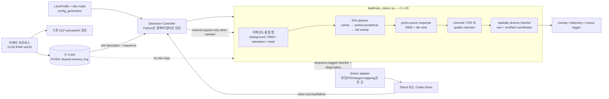
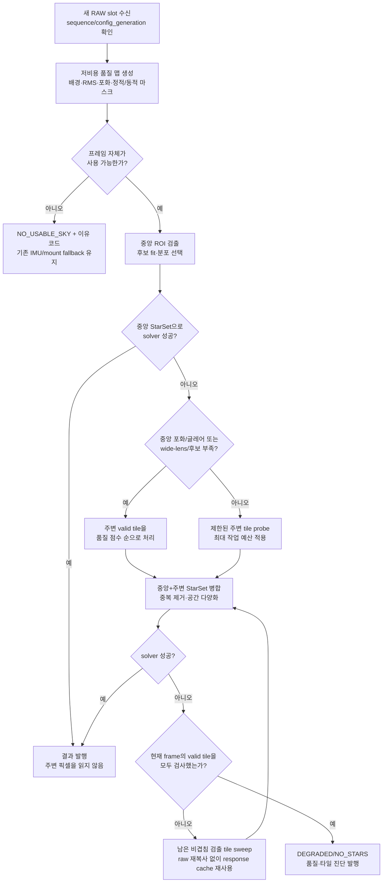

# PiFinder 전용 천체 디텍터 개발 방향 및 설계

> 광해·구름·주변 광원 전처리의 우선 구현과 SEP C 전환 결정은
> [고속 하늘 전처리 설계](mf_fast_sky_preprocessing_design_ko.md)를 따른다.

> 상태: 제안(implementation-ready design)
> 작성일: 2026-08-25
> 범위: 요청의 **1번 — 전용 디텍터의 개방 및 적용**. Cedar-Solve 전환이나
> 전용 플레이트 솔버 개발(2번)은 별도 ADR에서 결정한다. 이 설계는 현재 Tetra3와
> Cedar-Solve 양쪽에 연결할 수 있는 solver-neutral centroid 인터페이스를 정의한다.

## 1. 결론과 권고안

권고안은 `mf_detect_star`라는 **독립 C++20 코어 + 안정적인 C ABI**를
만드는 것이다. 첫 배포는 Python 솔버 프로세스가 이 라이브러리를 직접 호출하는
in-process 방식으로 하고, 프레임 전달을 POSIX shared-memory ring으로 바꾼다.
`pifinder-detectd` 데몬은 같은 코어를 재사용하는 선택 배포 형태이며, 알고리즘을
두 번 구현하지 않는다.

이 선택의 이유는 다음과 같다.

- 현재 Cedar Detect 공개본은 FSL-1.1-MIT이며 상용 제품·서비스에서 실질적으로
  같은 기능을 제공하는 ``Competing Use``를 허용하지 않는다. 현 PiFinder 번들은
  별도 허가로만 가능하다. 따라서 새 기본 경로에 Cedar 소스·바이너리·파생 코드를
  넣지 않는다.
- SEP는 **사용 가능한 후보**다. 전체 라이브러리가 LGPLv3이므로 상업 판매와
  소스 공개는 가능하되, 배포·교체 가능성·고지 의무를 준수해야 한다. 따라서
  단기에는 SEP C API를 성능/정확도 기준선 및 과도기 백엔드로 유지할 수 있다.
- 장기 기본값은 의존성 없는 clean-room C++ 구현으로 한다. Python/NumPy 변환,
  `Manager` pickle, gRPC, 중복 타일 검출을 없애므로 성능과 배포 제어권을 함께
  얻는다.

전용 코어는 2026-09-15 사용자 결정으로 MFDS의 5년 후 MIT 전환
조건으로 변경했다. `LicenseRef-MFDS-FSL-1.1-MIT-5year`를 사용한다.
PiFinder 통합 코드의 GPL과 과거 MIT 고지는 유지하며 상세 범위는
[LICENSING.md](../LICENSING.md)가 기준이다.

## 2. 현황 진단

현 구조는 이미 좋은 실험 기반을 갖고 있다.

- [`sep_detect.py`](https://github.com/hjoungjoo/MF_PiFinder/blob/main/python/PiFinder/sep_detect.py)는 풀프레임 12-bit RAW에서
  2×2 binning, 메시 배경 제거, 형태/가장자리/웜픽셀 필터를 수행한다.
- [`solver.py`](https://github.com/hjoungjoo/MF_PiFinder/blob/main/python/PiFinder/solver.py)는 Cedar 중심 → SEP 중심 → Cedar
  풀프레임 → SEP 풀프레임의 중앙 우선 cascade와 wide-tile rescue를 제공한다.
- [`mf_wide_solver.py`](https://github.com/hjoungjoo/MF_PiFinder/blob/main/python/PiFinder/mf_wide_solver.py),
  [`mf_wide_tiles.py`](https://github.com/hjoungjoo/MF_PiFinder/blob/main/python/PiFinder/mf_wide_tiles.py),
  [`mf_wide_distortion.py`](https://github.com/hjoungjoo/MF_PiFinder/blob/main/python/PiFinder/mf_wide_distortion.py)는 렌즈별
  타일·왜곡 보정의 중요한 기반이다.

하지만 픽셀 처리와 프레임 전달이 중복된다.

| 현재 지점 | 관찰된 비용/위험 | 새 설계의 처리 |
| --- | --- | --- |
| `camera_pi.py`의 `set_solver_raw()` | 코드 주석대로 Manager proxy가 RAW 배열을 pickle/copy한다. | 카메라와 디텍터가 같은 raw ring slot을 참조한다. |
| Cedar gRPC 경로 | 12-bit→8-bit 변환 후 Cedar shared-memory buffer에 다시 복사하고, 장애 시 TCP inline 전송으로 내려간다. | 기본 경로에서 gRPC와 중간 8-bit 프레임을 제거한다. |
| Cedar와 SEP 병행 | 동일 RAW에 서로 다른 전체 검출을 실행하고, 중심/풀프레임/타일 단계에서 다시 처리한다. | 한 frame context가 품질 맵·후보·response cache를 보유한다. |
| wide solver 타일 | 겹치는 타일마다 detector를 다시 호출할 수 있다. | 검출 타일은 비겹침 분할(+작은 halo)로 한 번만 읽고, solver tile은 centroid만 재그룹화한다. |

기존 동일 프레임 벤치에서는 1920×1080 조건에서 Cedar full-frame 검출 중앙값이
66.4 ms, SEP 검출은 143 ms였고 하이브리드 시도 총비용은 약 280 ms였다.
자세한 측정 조건과 결과는 [2026-08-01 3경로 벤치](https://github.com/hjoungjoo/MF_PiFinder/blob/main/docs/mf_report/mf_solver_3path_bench_20260801_ko.md)를
기준선으로 삼는다. 새 설계의 목표는 "검출기를 바꾼다"보다 **한 번 캡처한 RAW를
한 번의 소유권 체계 안에서 필요한 영역만 읽는다**에 있다.

## 3. 라이선스 결정

### 3.1 후보의 처리 방침

| 구성요소 | 라이선스/상태 | 새 설계에서의 위치 |
| --- | --- | --- |
| Cedar Detect | FSL-1.1-MIT. 공개 조건은 competing commercial use를 제한하며, 이 저장소의 번들은 별도 허가에 의존한다. | **새 기본값에서 제외.** 코드·바이너리·내부 구현의 포팅 금지. 필요 시 현 별도 허가 경로만 legacy fallback으로 격리. |
| SEP C/Python | upstream 전체 LGPLv3 (Python wrapper 일부 MIT). | **허용.** 단기 shadow/비교와 LGPL 준수형 백엔드에 사용 가능. |
| Tetra3 / Cedar-Solve | 이 저장소의 vendored Tetra3는 Apache-2.0이며 README는 Cedar-Solve도 Apache-2.0으로 명시한다. | 디텍터 결과를 소비하는 솔버 어댑터로 유지; 이번 범위에서 교체하지 않는다. |
| OpenCV 4.5+ | Apache-2.0. | 선택적 개발/검증 의존성으로는 허용하되, Raspberry Pi 런타임 코어의 필수 의존성으로 두지 않는다. |
| 새 detector 코드 | MFDS의 5년 MIT 전환 FSL 정책. | native 라이선스와 GPL 통합 코드의 적용 범위는 LICENSING.md 참조. |

### 3.2 SEP/LGPLv3를 사용할 때의 배포 체크리스트

SEP 사용은 배제 사유가 아니다. 다만 `sep` wheel 또는 C 라이브러리를 실제 제품에
포함하면 다음을 릴리스 게이트로 둔다.

1. 사용 버전, source URL, SHA256, 빌드 옵션, 패치 목록을 SBOM에 고정한다.
2. LGPLv3 전문, copyright/NOTICE, SEP의 대응 소스와 PiFinder에서 가한 SEP
   수정 소스를 제품/다운로드 페이지에 제공한다.
3. 가능하면 `libsep.so` **동적 링크**로 배포한다. 정적 링크가 불가피하면 사용자가
   수정한 LGPL 라이브러리로 다시 링크할 수 있도록 relinkable object 또는 동등한
   방법을 제공한다.
4. 소비자 기기(User Product)에서 라이브러리 교체를 기술적으로 막지 않으며,
   필요한 설치 정보도 제공한다. PiFinder 자체가 GPLv3인 점도 이 판단에 포함한다.
5. SEP upgrade/patch 때 파일별 라이선스와 NOTICE를 다시 스캔한다.

새 C++ 구현은 SEP/Cedar의 소스, 구조, test golden output을 베끼지 않는
**clean-room** 절차로 작성한다. 공개 논문과 수학적 아이디어를 참고하는 것은
가능하지만, 구현자는 Cedar/SEP 내부 코드를 보지 않은 상태에서 인터페이스와
테스트 명세로 구현한다. 초기 golden corpus의 정답은 카탈로그 투영, 수동 검수,
독립 plate-solve 교차검증으로 만들고 Cedar 출력만을 정답으로 삼지 않는다.

### 3.3 LGPLv3를 수용하는 두 단계 경로

LGPLv3를 수용한다면 전용 C++ 검출기가 완성될 때까지 기다릴 필요는 없다.
`DetectorBackend` C ABI를 먼저 고정하고 다음 backend를 같은 controller에 연결한다.

1. **SEP backend (즉시):** `libsep.so`를 동적 링크하는 얇은 C++ adapter를 만든다.
   Python `sep` 호출/배열 marshal은 줄이되, SEP 자체가 요구하는 데이터 형식 변환과
   background working memory는 benchmark에 명확히 계상한다.
2. **native backend (목표):** 동일 `FrameView → StarSet` ABI를 clean-room C++로
   구현한다. 성능·정확도 gate를 넘으면 default로 승격하고 SEP는 compatibility
   fallback/회귀 기준으로 남긴다.

이 방식이면 라이선스·출력 계약·필드 corpus를 먼저 안정화하면서, Cedar를 다시
기본 경로에 넣지 않고도 성능 개선을 단계적으로 검증할 수 있다.

참조: [Cedar Detect 라이선스](https://github.com/smroid/cedar-detect/blob/main/LICENSE.md),
[SEP 라이선스와 C API](https://github.com/sep-developers/sep#license),
[GNU LGPLv3 전문](https://www.gnu.org/licenses/lgpl-3.0.en.html),
[OpenCV 라이선스](https://github.com/opencv/opencv/blob/4.x/LICENSE).

## 4. 목표와 비목표

### 목표

- 10/12-bit mono 또는 Bayer-labelled RAW를 8-bit 변환/디베이어 없이 직접 처리한다.
- 광해, 달/가로등, 비네팅, 구름 글로우, 웜픽셀, 기구 차광, 지평선 간섭을
  **국소 품질 모델과 마스크**로 다룬다.
- 중앙부를 먼저 처리하되 중앙이 포화·저품질이면 즉시 주변부로 전환한다.
- 6 mm–16 mm 및 이후의 렌즈를 동일 코드로 지원하며, 렌즈별 보정값만 교체한다.
- 결과를 `(y, x)` 하나가 아니라 신뢰도·형상·좌표계·마스크 이유까지 포함한
  `StarSet`으로 반환한다.
- 인터넷, GPU, 특정 NPU, 클라우드 모델 없이 Pi 4/Pi 5에서 동작한다.
- 디텍터 실패는 "그럴듯한 별"을 꾸며내는 대신 `NO_USABLE_SKY`/`DEGRADED`로
  명시하고, 기존 IMU/마운트 fallback을 방해하지 않는다.

### 비목표

- 이 문서는 Tetra3 데이터베이스, Cedar-Solve 도입, 완전 신규 plate solver를
  결정하지 않는다.
- 완전히 포화된 센서, 불투명 구름, 별이 물리적으로 보이지 않는 장면에서 솔브를
  강제하지 않는다. 환경 독립성은 **거짓 검출 없이 정상적으로 실패하는 능력**까지를
  뜻한다.
- 초기 버전에서 neural network를 필수화하지 않는다. 학습 데이터·GPU 의존·모델
  라이선스가 환경 호환성과 재현성을 떨어뜨리므로, ML은 후속 rejection 보조 실험으로
  한정한다.

## 5. 전체 블록 다이어그램

중요한 경계는 다음과 같다.

- **카메라**는 RAW와 촬영 메타데이터의 소유자다.
- **native detector**는 픽셀을 읽고 `StarSet`을 만든다. 카탈로그, FOV,
  UI 회전, Tetra 호출을 모른다.
- **solver adapter**만 raw/rectified/solver 좌표를 변환한다. 이로써
  `solver_frame_map`과 wide distortion 로직이 여러 detector에 중복되지 않는다.
- **controller**만 중앙 우선 단계의 성공 여부를 solver feedback으로 결정한다.

기존 하류 계약은 유지한다. 특히
[`solver_frame_map.py`](https://github.com/hjoungjoo/MF_PiFinder/blob/main/python/PiFinder/solver_frame_map.py)의 회전/FOV/
`target_pixel` 규약, `SolveResult`/`SolveDiagnostics`, Integrator와 정렬 체인은
바꾸지 않는다. 자동 노출에는 `selected_count`(solver로 보낸 상위 N개)가 아닌
**기본 마스크 후 실제 검출 수**를 기존 `Centroids` 의미로 제공하고,
`selected_count`, `masked_count`, `usable_area_ratio`는 새 진단 필드로 분리한다.

## 6. 작업 순서도 — 중앙 우선, 주변 타일, 전체 프레임

### 6.1 중앙 우선의 정확한 의미

중앙 ROI는 기본적으로 optical center를 중심으로 한 **렌즈 프로파일의 유효 영역**이다.
그 크기는 고정 512 px가 아니라 `LensProfile.center_roi`에 저장한다. 중앙에서
`min_stars`, 분포 점수, SNR, 포화 비율을 만족해 solver까지 성공한 경우에만 조기
종료한다.

달·가로등·기구가 중앙에 있을 때에는 중앙 우선이 오히려 지연이 될 수 있다. 따라서
중앙 포화 component, halo, 급격한 배경 gradient, static obstruction 비율이 임계치를
넘으면 controller는 중앙 solver 실패를 기다리지 않고 주변 tile 단계로 넘어간다.
6 mm profile은 기본적으로 주변 ring의 최소 probe 수를 높여, "중앙은 달이고 별은
가장자리에만 있는" 장면을 놓치지 않게 한다.

### 6.2 검출 타일과 solver 타일의 분리

현재의 overlapping solver tile을 그대로 detector tile로 쓰면 경계 별과 background를
여러 번 계산한다. 새 설계는 다음처럼 나눈다.

| 구분 | 형상 | 목적 | 중복 방지 |
| --- | --- | --- | --- |
| 검출 tile | 비겹침 격자 + 6–12 px read halo | point response/centroid 계산 | 후보는 tile interior 소유자에게만 귀속 |
| solver tile | 렌즈/FOV별 겹침 가능 crop | Tetra/Cedar-Solve가 요구하는 기하로 StarSet을 재그룹 | 픽셀을 다시 읽지 않음 |

즉, full-frame 모드는 "큰 프레임을 새로 만들고 재검출"하는 뜻이 아니라 **남은 valid
검출 tile을 모두 한 번씩 완료**하는 뜻이다.

## 7. native detector 알고리즘

### 7.1 한 frame context에서의 파이프라인

| 단계 | 방법 | 산출물 | 환경 요인 대응 |
| --- | --- | --- | --- |
| A. 입력 검증 | stride, bit depth, sequence, profile fingerprint, 최신성 확인 | 안전한 raw view | 오래된 프레임/렌즈 변경 결과 폐기 |
| B. 품질 맵 | downsampled block histogram의 median/MAD, saturation fraction, gradient, mask coverage | 저해상도 `QualityMap` | 광해/구름/비네팅을 전역 threshold가 아닌 지역 값으로 판정 |
| C. 마스크 | dark-frame bad-pixel map, 렌즈 edge-validity map, 사용자가 정한 차광 polygon, 포화 blob+halo | pixel/tile validity | 웜픽셀, 달·가로등 bloom, 지평선/기구 간섭 제외 |
| D. 점원 반응 | background를 뺀 정규화 영상에 separable matched-filter bank 적용 | scale별 response maxima | PSF 크기·defocus·렌즈별 해상도에 적응 |
| E. 후보 정밀화 | local maximum 병합, 5×5/7×7 robust weighted centroid 또는 작은 PSF fit | sub-pixel centroid, flux, covariance, FWHM, eccentricity, SNR | 단일 픽셀 noise, 구름 texture, trail 분리 |
| F. 선택 | score와 최소 거리/격자 quota로 16–48개를 다양하게 선택 | solver용 `StarSet` | 밝은 한 영역의 후보가 전체 기하를 독점하지 못하게 함 |

수학적으로는 각 위치의 background `B(x,y)`와 noise `σ(x,y)`를 품질 맵에서
보간하고, 원시 신호를 다음처럼 정규화한다.

`Z(x,y) = (I(x,y) - B(x,y)) / max(σ(x,y), σ_floor)`

각 PSF scale `s`에 대해 정규화된 separable kernel `K_s`와의 반응 `R_s = Z * K_s`를
계산하고, 국소 최대값만 남긴다. `σ`는 MAD 기반의 robust estimate를 기본으로 하고,
camera profile의 read-noise/gain 정보가 검증되어 있으면 photon/read-noise floor와
결합한다. 이 방식은 SEP/Cedar의 구현을 재사용하지 않는 독자 구현 명세다.

### 7.2 후보 거절 규칙

거절은 단일 전역 `sigma` 값이 아니라 다음 flags의 조합으로 한다. flag는 숨기지 않고
diagnostics에도 보낸다.

- `BAD_PIXEL`: 해당 camera/gain/temperature band의 dark-frame defect map과 일치.
- `SATURATED_OR_HALO`: 포화 component 또는 확장 halo에 속함.
- `EDGE_OR_INVALID_MASK`: 렌즈별 유효 화각 밖, vignette/차광 mask 안, 또는 tile
  boundary 소유권 밖.
- `NON_POINTLIKE`: PSF가 너무 넓거나, eccentricity가 크거나, 인접 후보 군집이
  구름/건물 texture 패턴을 이룸.
- `TRAIL_SUSPECT`: 방향성 길이가 현재 IMU exposure-motion과 맞지 않는 streak.

웜픽셀 맵은 **dark/cap frame**에서 만드는 것을 권장한다. 추적 중 하늘 프레임의
"항상 같은 위치"만으로 map을 만들면 실제 별도 sensor 좌표에 고정되어 보일 수 있다.
부득이한 sky corpus 갱신은 dithering 또는 tracking-off 조건을 메타데이터로 남긴
세션만 사용한다.

### 7.3 중앙과 주변에서 같은 검출기를 쓰는 이유

중앙용 Cedar, 주변용 SEP처럼 detector를 갈라 두면 threshold·centroid convention·웜픽셀
정책이 달라져서 평가가 어렵다. 새 코어는 **동일한 A–F 단계**를 쓰고 ROI planner만
바꾼다. 따라서 16 mm 중앙 우선과 6 mm 주변 우선은 서로 다른 detector가 아니라
서로 다른 `LensProfile`/`SearchPolicy`다.

## 8. 렌즈·좌표계·보정 설계

### 8.1 LensProfile

렌즈를 mm 숫자만으로 처리하지 않는다. 다음 fingerprint를 가진 immutable profile을
프레임 경계에서 교체한다.

| 항목 | 예 |
| --- | --- |
| 식별 | camera type, sensor raw size, bit depth, readout/crop, lens key 또는 serial, profile revision |
| 기하 | optical center, Brown–Conrady coefficients, valid image circle, display-independent rotation 기준 |
| 검출 | central ROI, radial zone별 예상 PSF scale, edge margin, tile 크기/순서, SNR floor |
| 광학 결함 | vignette/obstruction mask, flat-field quality map, 포화 halo 확장 정책 |
| 상태 | `provisional` / `validated`, on-sky validation timestamp와 hold-out residual |

6 mm에는 중심만 좋은 16 mm와 다른 profile이 필요하다. 초기에는 3개 이상 radial zone
(center/mid/edge)의 PSF·noise·mask를 따로 보정하고, 주변 tile sweep과 왜곡 보정을
기본 활성화한다. 16 mm는 중앙 ROI가 정상일 때 조기 종료가 더 자주 일어난다.

### 8.2 좌표계 소유권

| 좌표 | 소유자 | 용도 |
| --- | --- | --- |
| `native_yx` | camera + native detector | sensor profile의 필수 rot90만 적용한 풀 RAW 기준. bad-pixel/mask와 항상 같은 좌표. |
| `rectified_yx` | native detector | 검증된 LensProfile이 있을 때 centroid에만 적용한 왜곡 보정 좌표. RAW 전체를 warp하지 않는다. |
| `solver_yx` | Python solver adapter | display/camera rotation, canvas, FOV, target pixel을 `solver_frame_map` 규약으로 한 번만 변환. |

full image rectification은 별 에너지를 재샘플하고 CPU를 많이 쓰므로 금지한다. detector는
native pixel에서 centroid를 fit하고, 검증된 경우에만 그 **점**을 rectified 좌표로
변환한다. 이는 현재 [`mf_wide_distortion.py`](https://github.com/hjoungjoo/MF_PiFinder/blob/main/python/PiFinder/mf_wide_distortion.py)의
좋은 방향을 core API로 승격하는 것이다.

## 9. 프로세스·메모리·Python 연동

### 9.1 기본: shared-memory ring + 직접 C ABI

카메라는 3–4개의 고정 크기 RAW slot을 만들고, 각 slot header에 아래를 넣는다.

`sequence, state, timestamp, width, height, stride, bit_depth, exposure, gain,
sensor_temperature, profile_fingerprint, config_generation, CRC(optional)`

상태는 `FREE → WRITING → READY → READING → FREE`로 원자적으로 전이한다. detector는
가장 최신 READY slot만 claim하며, 밀린 오래된 frame을 처리하지 않는다. 카메라는
`READING` slot을 덮어쓰지 않고, 소비자가 뒤처지면 아직 읽히지 않은 오래된 READY
slot을 버린다. 모든 결과에 같은 `sequence`와 `config_generation`을 붙여, 렌즈 변경
직전의 결과가 새 렌즈로 publish되는 일을 막는다.

Python은 다음 두 역할만 맡는다.

1. `ctypes` 또는 얇은 pybind11 binding으로 C ABI를 호출하고 raw slot descriptor를
   전달한다. NumPy `astype`, `copy`, list 변환을 호출 경로에 넣지 않는다.
2. detector stage 결과를 Tetra3/Cedar-Solve input으로 변환하고, solver feedback에
   따라 `EXTEND_PERIPHERY` 또는 `FULL_SWEEP`을 요청한다.

권장 C ABI는 예외가 Python 경계를 넘지 않도록 error code만 반환한다.

| API | 핵심 입력 | 핵심 출력 |
| --- | --- | --- |
| `pf_detector_create(profile, limits)` | immutable LensProfile, worker/work budget | detector context |
| `pf_detector_begin(frame_view)` | shared raw pointer + header | sequence-bound frame context |
| `pf_detector_run(stage)` | `CENTER`, `PERIPHERY`, `FULL_SWEEP`, deadline | `PFStar[]`, tile diagnostics, result status |
| `pf_detector_finish()` | context | cache/slot release |

`PFStar`에는 `native_yx`, `rectified_yx`, flux, SNR, covariance, FWHM, eccentricity,
score, `tile_id`, flags를 넣는다. adapter에는 final selection만 주되, overlay와 corpus
기록에는 candidate/거절 사유도 남긴다.

### 9.2 선택: `pifinder-detectd` 데몬

데몬은 다음 때만 선택한다: native crash를 Python/UI와 격리해야 할 때, detector를
독립 업데이트해야 할 때, 또는 다른 프로세스가 같은 StarSet을 구독해야 할 때.

- TCP/gRPC 대신 local Unix domain socket은 **제어 메시지**만 전송한다.
- RAW와 결과 배열은 같은 shared-memory ring에서 전달한다.
- `systemd`는 `Restart=on-failure`, watchdog, `RuntimeDirectory`, 최소 권한,
  명시적인 `/dev/shm` 접근으로 관리한다.
- 데몬 장애 시 controller는 한 번 native in-process fallback을 시도하거나,
  해당 frame을 `DETECTOR_UNAVAILABLE`로 처리한다. Cedar로 몰래 전환하지 않는다.

둘은 `libpifinder_detect.so` 하나를 공유한다. daemon을 만든다고 detector 알고리즘을
별도 복제하지 않는다.

## 10. 성능·이식성 목표

다음은 구현 완료 주장치가 아니라 **수락 기준 초안**이다. 기준 장면은 imx462
1920×1080 12-bit RAW, 프로파일/마스크가 warm 상태이고 CPU 경쟁이 기록된 경우다.
Pi 4와 Pi 5에서 따로 측정한다.

| 측정 | Pi 4 P95 목표 | Pi 5 P95 목표 | 비고 |
| --- | ---: | ---: | --- |
| center stage (quality map 포함) | ≤45 ms | ≤30 ms | 중앙 solver 호출 시간 제외 |
| center + 품질 상위 주변 probe | ≤80 ms | ≤55 ms | raw 재복사 없음 |
| full valid-tile sweep | ≤120 ms | ≤80 ms | 유효 영역 전수, solver 시간 제외 |
| detector 추가 RSS | ≤48 MiB | ≤48 MiB | 4 slot RAW 자체는 camera transport 예산으로 별도 계상 |

구현 원칙은 다음과 같다.

- scalar reference path와 ARM NEON path를 모두 제공한다. ARMv8-A package는 NEON을
  사용하고, x86_64 CI는 scalar/SSE가 아닌 **동일 결과성**을 우선 검증한다.
- C++ worker 수는 고정 하드코딩하지 않고 `performance`, `balanced`, `power-save`
  profile로 제한한다. UI, camera, solver가 굶지 않도록 기본은 한 core를 남긴다.
- background grid와 tile scratch는 재사용하고, full-frame `float32` 복사본을 만들지
  않는다. uint16 RAW는 read-only이다.
- deadline을 넘길 예상이면 최신 frame 우선 정책을 택한다. 부분 후보를 정상 결과로
  위장하지 않고 `DEADLINE_EXCEEDED`로 표시한다.

## 11. 검증 데이터와 수락 기준

### 11.1 corpus 축

각 RAW에는 camera/lens/profile revision, exposure/gain, 온도, 위치/시간, IMU motion,
마스크 상태, 최종 solver 결과를 붙인다. 최소 축은 아래와 같다.

| 축 | 반드시 포함할 조건 |
| --- | --- |
| 센서 | imx296, imx462/imx290, HQ/imx477 또는 지원 대상별 대표 |
| 렌즈 | 16 mm 기준, 6 mm 광각, 중간 8/10/12 mm |
| 하늘 | 어두운 하늘, 서울급 광해, 달/가로등 중심·주변, 박무/얇은 구름, 무별/완전 포화 |
| 광학 | 깨끗한 렌즈, dew/defocus, 강한 vignette, 기구/지평선 mask |
| 동작 | 정지, 천천히 push-to, exposure 중 motion, 새 렌즈/새 calibration 적용 직후 |

### 11.2 지표

- detector: 검수된 실별의 recall/precision, bad-pixel·glare·ground 후보율,
  centroid repeatability, spatial spread, `NO_USABLE_SKY`의 정직성
- solver: solve success rate, false-solve rate, matches, RMSE, same-frame
  RA/Dec/Roll 편차, 목표 pixel alignment 오차
- 시스템: detect latency(P50/P95/P99), frame age, raw-copy 횟수, CPU/RSS,
  thermal throttling, service restart 후 recovery

shadow 단계에서는 새 detector 결과를 **절대 publish하지 않는다**. 같은 frame에
SEP/Cedar(허가된 기존 경로)/native를 병렬 기록하고, 결과를 독립 catalog projection과
solver match로 교차 검증한다. 기본 전환은 다음을 모두 충족할 때만 한다.

1. 16 mm의 유효 corpus에서 현 기본 경로보다 solve 성공률 또는 P95 latency가
   열화하지 않는다.
2. 6 mm의 "중앙 불량·주변 별" corpus에서 perimeter tile 경로가 실제 solve를
   회복하며, 왜곡 보정 hold-out residual이 정해 둔 한계를 통과한다.
3. 무별/포화/지상광 corpus에서 false solve가 발생하지 않으며, 후보 폭주가 deadline을
   넘기지 않는다.
4. license/SBOM/소스 제공 검토와 cold boot·daemon restart 시험을 통과한다.

## 12. 구현 순서

아래 순서는 캘린더 추정이 아니라 rollback 가능한 의존 순서다.

1. **P0 — 계약과 코퍼스:** MIT header, clean-room 기록, SBOM template,
   `PFStar`/좌표계 명세, RAW replay corpus와 benchmark harness를 먼저 고정한다.
2. **P1 — reference core:** C++ scalar로 품질 맵, 중앙 ROI, bad-pixel/포화 mask,
   matched filter, subpixel centroid, spatial selection을 구현한다. Python 호출은
   파일 replay에 한정한다.
3. **P2 — 성능 경로:** band/tile scratch 재사용, NEON, profiler, POSIX ring을
   추가한다. `camera_pi.py`의 `set_solver_raw` full-array 전달과 Cedar gRPC copy를
   제거할 준비를 한다.
4. **P3 — shadow adapter:** 현재 `solver_frame_map` 규약으로 Tetra3에 연결하되,
   모든 native 결과는 telemetry만 남긴다. SEP C backend도 같은 `StarSet` 계약으로
   감싼다.
5. **P4 — controller/wide lens:** solver feedback 기반 center→periphery→full sweep,
   6 mm radial profile, centroid-space distortion, tile consensus를 연결한다.
6. **P5 — field gate:** Pi 4/Pi 5 장시간 야간 시험, no-star/daemon restart/fault
   injection, LGPL 패키지 배포 리허설을 통과한 뒤 opt-in으로 전환한다.
7. **P6 — 기본값 전환:** native를 기본으로, SEP를 명시적 compatibility fallback으로
   낮춘다. Cedar default 의존과 별도 바이너리 배포는 제거하거나 legacy package로
   분리한다.

## 13. 위험과 대응

| 위험 | 대응 |
| --- | --- |
| "별이 전혀 안 보이는" 장면을 detector 실패로 오해 | `NO_USABLE_SKY`를 정상 결과로 모델링하고 IMU/mount fallback에 명확히 전달 |
| 6 mm edge 왜곡이 centroid 정확도를 망침 | full image warp 금지, centroid-space 보정, center/mid/edge hold-out calibration |
| 새 native code의 crash/메모리 오류 | C ABI error boundary, ASan/UBSan/x86 fuzz, slot generation 검증, optional daemon isolation |
| 한 타일의 구름/건물 texture가 후보를 독점 | quality score, tile quota, shape/cluster flag, global spatial diversity selection |
| 렌즈 교체 중 이전 결과 publish | profile fingerprint/config generation/sequence 세 값 모두 일치할 때만 publish |
| LGPLv3 배포 누락 | release CI의 SBOM·NOTICE·source bundle·dynamic-link/relink checklist를 필수화 |
| 현장 성능이 목표 미달 | scalar correctness를 유지한 채 response/profile을 profile하고, tile budget을 낮추며, SEP backend로 즉시 rollback |

## 14. 다음 ADR에서 확정할 항목

1. 1차 릴리스에서 SEP C backend를 직접 포함할지, Python SEP만 shadow 기준으로
   남길지
2. `mf_detect_star`의 stable C ABI 도입 시점, 공개 전환 시점과 버전 호환 정책
3. raw ring을 camera process가 소유할지, 별도 capture service가 소유할지
4. 6 mm 렌즈의 첫 calibrated `LensProfile`과 현장 mask 편집 UI
5. 2번 과제(기존 Tetra3 유지, Cedar-Solve 사용, 전용 solver 개발)의 별도 평가 기준

## 참고 자료

- 현 PiFinder Cedar 번들 및 별도 상용 허가 설명: [`bin/README.md`](https://github.com/hjoungjoo/MF_PiFinder/blob/main/bin/README.md)
- 현 풀프레임/SEP 구현 설계: [SEP full-frame 구현](https://github.com/hjoungjoo/MF_PiFinder/blob/main/docs/mf_dev/mf_sep_fullframe_impl_ko.md)
- 현 광각 tile 설계: [wide-angle solver 설계](https://github.com/hjoungjoo/MF_PiFinder/blob/main/docs/mf_dev/mf_wide_angle_solver_design_ko.md)
- 현 실측 기준선: [3경로 solve 벤치](https://github.com/hjoungjoo/MF_PiFinder/blob/main/docs/mf_report/mf_solver_3path_bench_20260801_ko.md)
- Cedar Detect FSL-1.1-MIT: <https://github.com/smroid/cedar-detect/blob/main/LICENSE.md>
- SEP C/Python 라이브러리와 license: <https://github.com/sep-developers/sep>
- OpenCV Apache-2.0: <https://github.com/opencv/opencv/blob/4.x/LICENSE>
